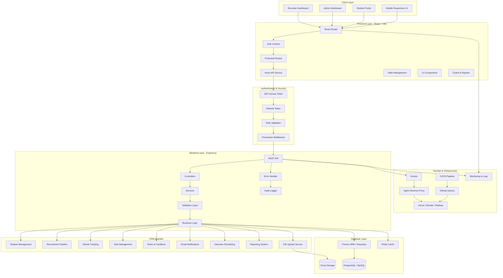

# CRM React App

A modern **Customer Relationship Management (CRM)** application built with React.  
This app helps businesses manage customer data, track interactions, and streamline workflows with a clean, responsive interface.

---

## Features
- **User Authentication**: Secure login and registration system.
- **Dashboard**: Overview of customer activity, tasks, and KPIs.
- **Customer Management**: Add, edit, and delete customer records.
- **Search & Filter**: Quickly find customers by name, email, or status.
- **Task Tracking**: Assign and monitor tasks linked to customers.
- **Responsive Design**: Works seamlessly across desktop and mobile devices.

---

##  Tech Stack
- **Frontend**: React, React Router, Context API / Redux
- **UI Frameworks**: Material-UI / TailwindCSS
- **Backend (optional)**: Node.js, Express.js
- **Database**: MySQL / MongoDB
- **Version Control**: Git & GitHub

---

## Workflow Articeture 



##  Screenshots
_Add screenshots of your app here (stored in `/images` folder):_


---

##  Installation & Setup
Clone the repository and install dependencies:

```bash
git clone https://github.com/yourusername/crm-react-app.git
cd crm-react-app
npm install

